[](README.md)

<div align="center">
  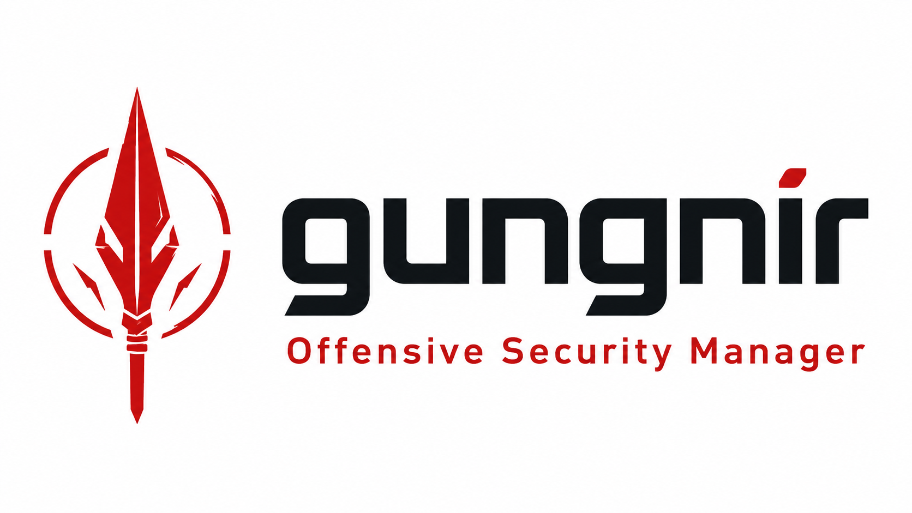

  # Gungnir Community - Offensive Security Manager

  **Plataforma de gestión del ciclo de vida de pentesting - libre y open source**

  *Powered by [AllSafe Security Solutions](https://www.allsafe.com.ar)*

  
  
  
  
  

  [](https://allsafe.com.ar/gungnir-community/)
</div>

---

Gungnir Community es una plataforma de gestión de pentesting libre y open source que cubre todo el ciclo de vida del engagement - desde el onboarding del cliente hasta la entrega del informe PDF.

> El nombre proviene de Gungnir, la lanza de Odín en la mitología nórdica. Forjada por los enanos de Nidavellir, nunca falla su objetivo. Un símbolo de precisión y fuerza imparable.

---

## 🤝 Engagements de la Comunidad

Gungnir tiene un intercambio de engagements integrado: **exportá cualquier engagement como ZIP e importalo en cualquier instancia con un solo clic** — hallazgos, fases, operation logs, scope y archivos de evidencia incluidos.

La comunidad comparte walkthroughs, writeups CTF y templates metodológicos en la carpeta [`community-engagements/`](community-engagements/) de este repositorio. Descargá uno, importalo, y tenés un engagement completamente documentado listo para explorar.

El listado completo está en [`community-engagements/`](community-engagements/) — walkthroughs CTF (HTB, VulnHub), escenarios de entrenamiento y templates metodológicos, con nuevas contribuciones de la comunidad.

**Cómo importar:** Engagements → **Importar** → seleccioná el `.zip`. Todo se recrea automáticamente con nuevos IDs.

**Cómo compartir el tuyo:**
1. Abrí cualquier engagement → **Exportar ZIP** en el sidebar
2. Revisá el ZIP — sin credenciales reales, datos del cliente ni IPs de producción
3. Abrí un Pull Request agregando tu `.zip` a `community-engagements/` con una descripción breve

> ⚠️ Siempre inspeccioná los ZIPs de terceros antes de importarlos. El `engagement.json` es texto plano — podés abrirlo en cualquier editor.

---

## ¿Qué es Gungnir Community?

Gungnir Community incluye todo lo que un equipo de pentesting necesita para ejecutar engagements profesionales:

- **Ciclo de vida completo del engagement** - clientes, fases (Planificación → Reconocimiento → Escaneo → Explotación → Post-Explotación → Reporte), o **modo custom** con fases completamente personalizadas (nombre libre, plan de trabajo, carga de documentos y actualizaciones de progreso); operation logs, gestión de scope, carga de evidencias por fase (con badge de conteo), mapeo MITRE ATT&CK
- **Exportar/Importar engagements (ZIP)** - exportá cualquier engagement como un ZIP portátil e importalo en cualquier instancia de Gungnir; incluye todo: hallazgos, fases, operation logs, scope, técnicas y archivos de evidencia
- **Editor de hallazgos** con calculadora visual CVSS 3.1, clasificación CWE + OWASP y seguimiento de estado
- **Auto-populate por CVE** - ingresá un CVE ID y Gungnir completa automáticamente el vector CVSS, score, descripción y CWE desde la API de NVD
- **Reporte PDF de pentesting** - salida profesional con secciones ejecutiva y técnica
- **Importación XML** - importar hallazgos desde Nessus (.nessus), Burp Suite (.xml), OpenVAS (.xml) y Nmap (-oX .xml) directamente en cualquier fase del engagement
- **Arsenal de comandos** - 2.300+ comandos de pentesting buscables (Recon, Web, Network, Active Directory, Post-Explotación, Evasión y más) - incluye OWASP ZAP, tshark, searchsploit, smbmap, wes-ng, técnicas SysNative Windows y más
- **Templates de hallazgos** - 15 templates preconfigurados (SQLi, XSS, CSRF, SSRF, XXE, RCE, path traversal, credenciales por defecto, open redirect, etc.) + biblioteca personalizada
- **OSINT / Recon** - Shodan, VirusTotal, Censys, crt.sh, RDAP, DNS usando tus propias API keys (sin vendor lock-in)
- **Notas** - notas personales en markdown con sistema de tags, pin y compartir entre usuarios
- **Research Papers** - editor estructurado de investigación de vulnerabilidades (templates Black Hat / académico / técnico) con integración directa a Exploit-DB - buscá, previsualizá y guardá papers en tu biblioteca local
- **Auth** - JWT (12h), TOTP 2FA (RFC 6238), lockout de cuenta, control de acceso por rol
- **Internacionalización** - Español (por defecto) e Inglés, configurable por usuario

> ¿Buscás **feeds de scanners Nessus/OpenVAS en vivo**, **sincronización con CRM AllSafe** o el **dashboard de Operaciones ejecutivo**? Esas funcionalidades están disponibles en [Gungnir Pro](https://www.allsafe.com.ar).

---

## Community vs Pro

| Funcionalidad | Community | Pro |
|---|:---:|:---:|
| Gestión de clientes | ✅ | ✅ |
| Ciclo de vida del engagement (fases, logs, scope, evidencias por fase) | ✅ | ✅ |
| Modo custom (fases completamente personalizadas) | ✅ | ✅ |
| Exportar/Importar engagements (ZIP) | ✅ | ✅ |
| Repositorio de engagements community | ✅ | ✅ |
| Editor de hallazgos (CVSS 3.1, CWE, OWASP, MITRE) | ✅ | ✅ |
| Reporte PDF de pentesting | ✅ | ✅ |
| Importación XML (Nessus, Burp, OpenVAS, Nmap) | ✅ | ✅ |
| Arsenal de comandos (2.300+ comandos, incl. OWASP ZAP) | ✅ | ✅ |
| Templates de hallazgos (15 built-in + personalizados) | ✅ | ✅ |
| Notas con compartir | ✅ | ✅ |
| OSINT / Recon (Shodan, VirusTotal, Censys, crt.sh, DNS) | ✅ | ✅ |
| Auto-populate por CVE (NVD) | ✅ | ✅ |
| TOTP 2FA + lockout de cuenta | ✅ | ✅ |
| Roles: admin / auditor / pentester | ✅ | ✅ |
| i18n: Español + Inglés | ✅ | ✅ |
| Audit log | ✅ | ✅ |
| Mapa de Ataque (canvas de topología de red interactivo) | ✅ | ✅ |
| Feed de scans Nessus en vivo | ❌ | ✅ |
| Feed de tareas OpenVAS en vivo | ❌ | ✅ |
| Sync CRM AllSafe | ❌ | ✅ |
| Dashboard de Operaciones (métricas ejecutivas, gráficos) | ❌ | ✅ |
| Branding PDF personalizado + logo de organización | ❌ | ✅ |
| Research Papers (editor estructurado + integración Exploit-DB) | ✅ | ✅ |

> **Upgrade path**: Community y Pro comparten el mismo esquema de base de datos. Actualizar es un reemplazo de archivos - sin migraciones necesarias.

---

## Screenshots

<div align="center">

**Dashboard**
<br/>
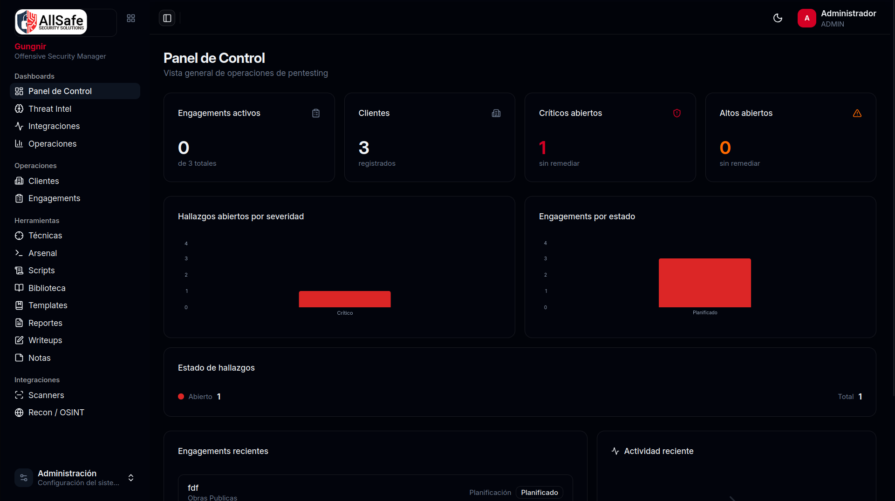

<br/><br/>

| **Editor de Hallazgos** | **Reporte PDF** |
|:---:|:---:|
| 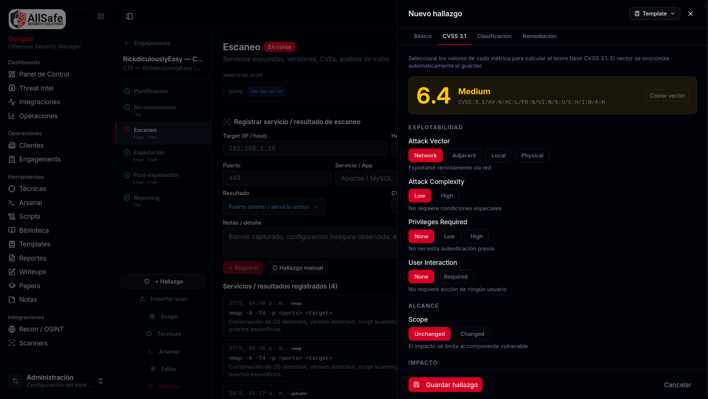 | 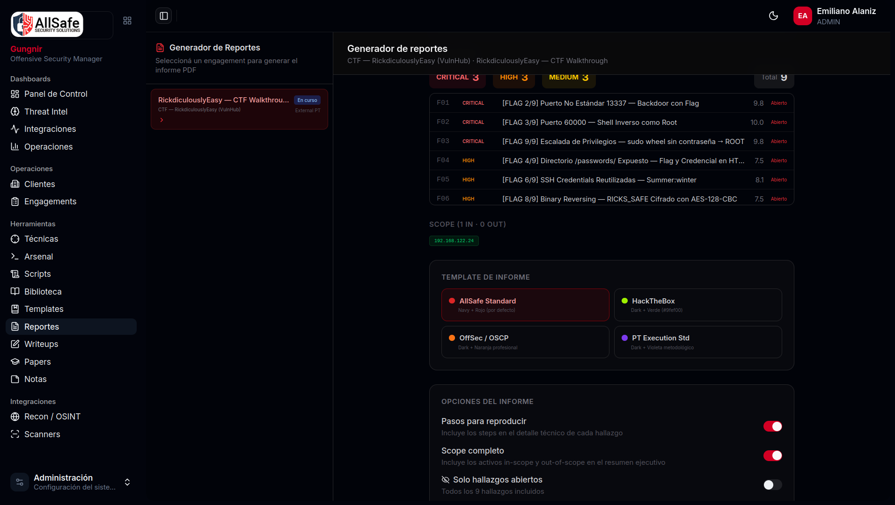 |

<br/>

| **Arsenal de Comandos (2.300+ comandos)** | **Browser de Técnicas** |
|:---:|:---:|
| 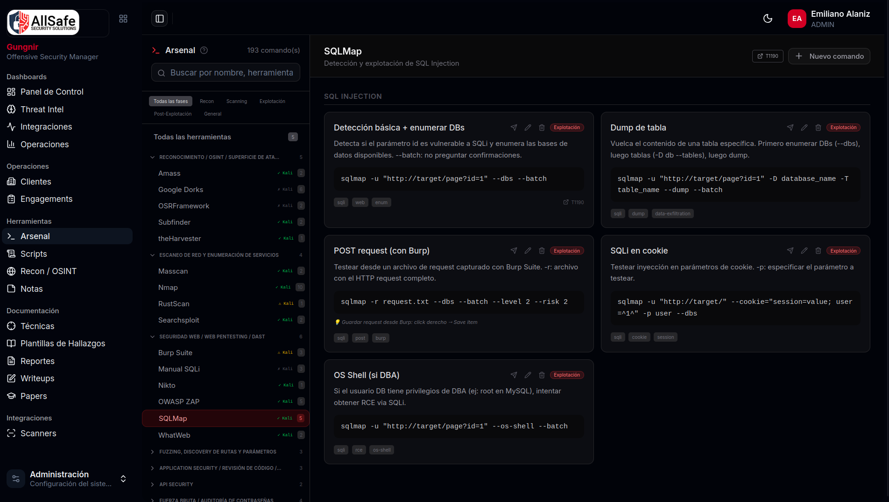 | 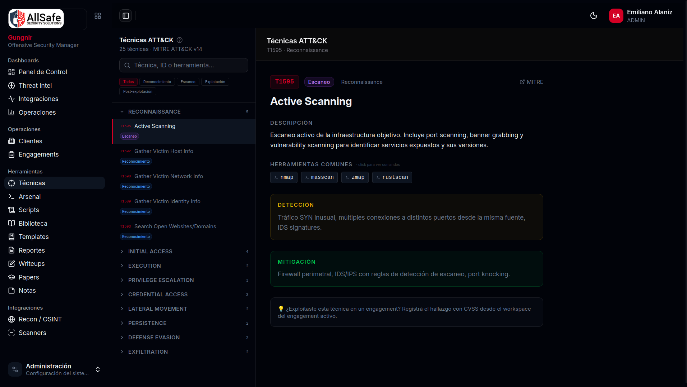 |

<br/>

| **OSINT / Recon** | **Notas** |
|:---:|:---:|
| 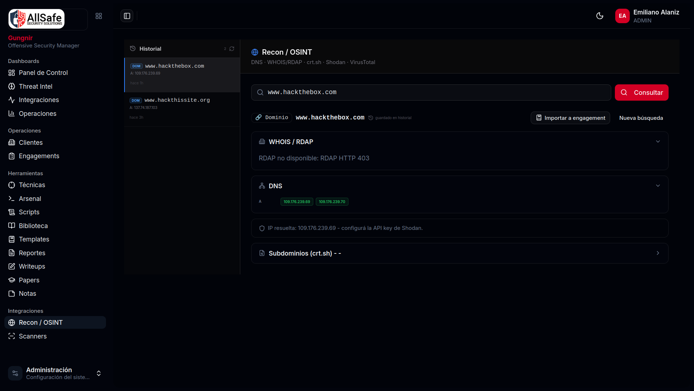 | 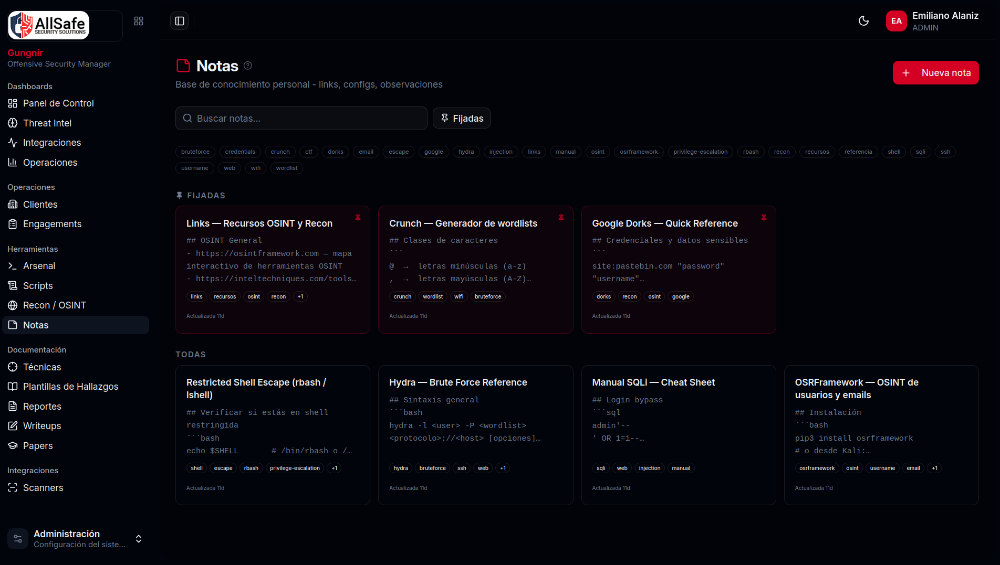 |

<br/>

| **Research Papers - Integración Exploit-DB** | **Research Papers - Editor estructurado** |
|:---:|:---:|
| 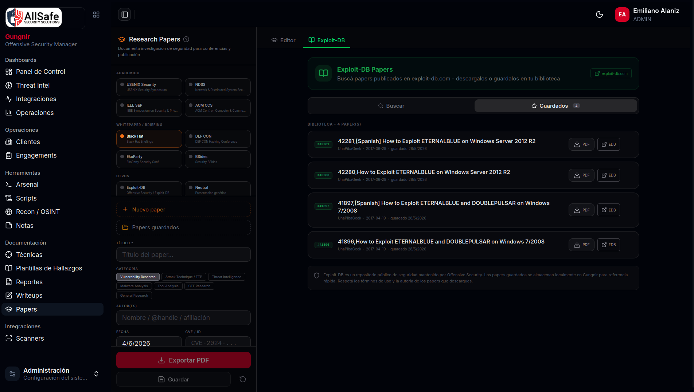 | 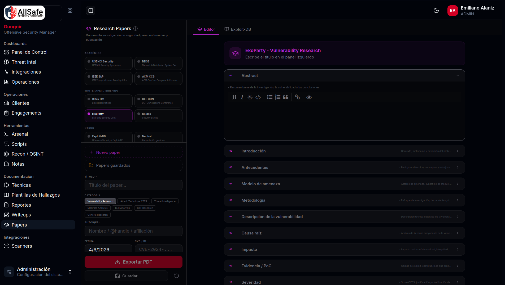 |

<br/>

| **Biblioteca de Scripts** | **Mapa de Ataque** |
|:---:|:---:|
| 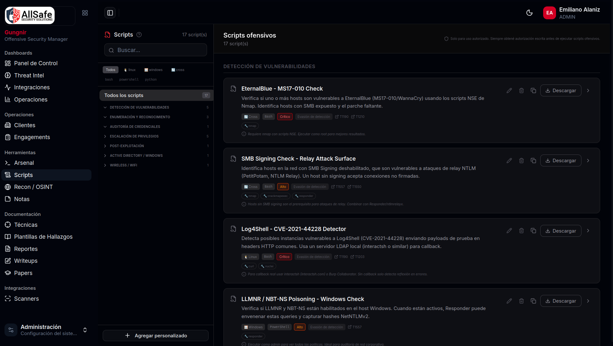 | 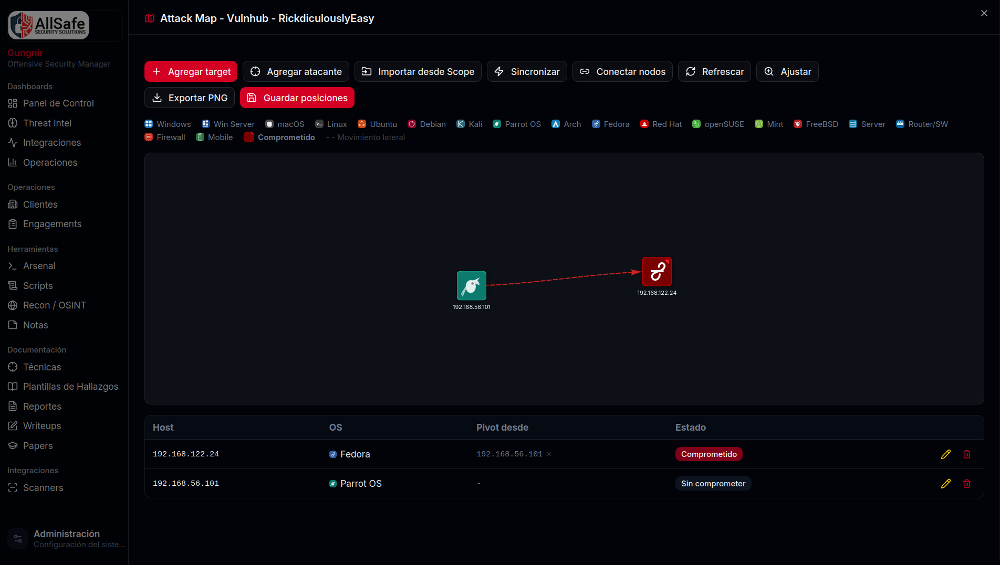 |

<br/>

**Espacio de Trabajo del Engagement**
<br/>
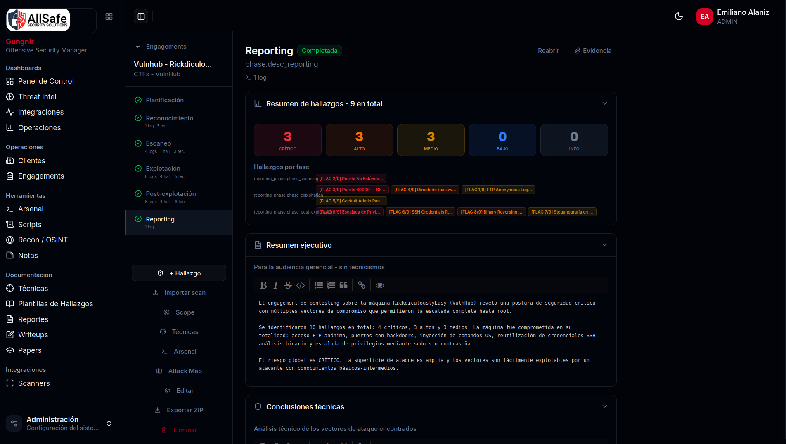

<br/><br/>

**Reporte PDF**
<br/>
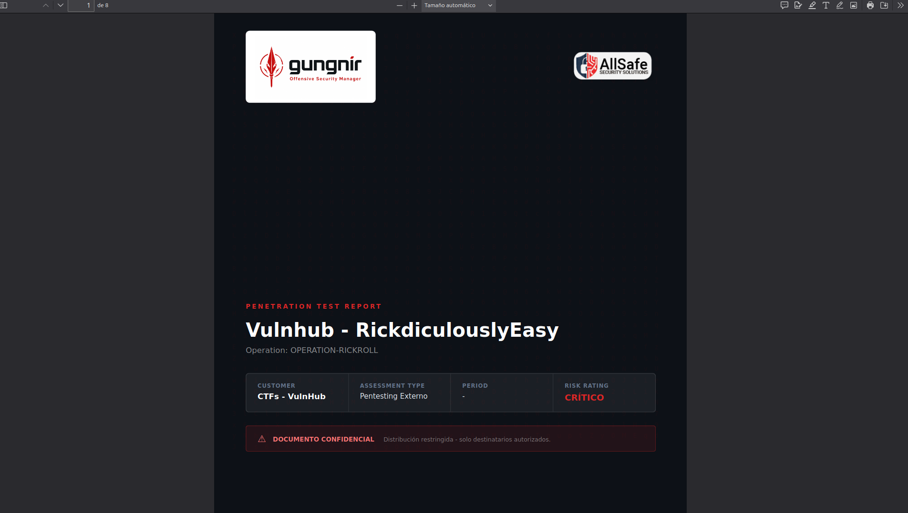

</div>

---

## Características principales

### Ciclo de vida del Engagement
- **Gestión de clientes** - empresa, industria, contacto, historial de engagements
- **Engagements** - ciclo de vida completo con fases estructuradas: Planificación → Reconocimiento → Escaneo → Explotación → Post-Explotación → Reporte; o **modo custom** — creá engagements con fases completamente personalizadas (nombre libre, plan de trabajo, carga de documentos y actualizaciones de progreso)
- **Operation logs** - registro con timestamp de comandos/herramientas por fase, con objetivo, herramienta, comando, notas y resultado (éxito/fallo); **Sync de scope** - importación de todos los targets únicos desde los logs al scope con puertos y OS inferidos
- **Gestión de scope** - activos en/fuera de scope con tipo de OS, lista de puertos, flag pwned y resumen de vulnerabilidades
- **Carga de evidencias** - adjuntos de archivos **por fase** (un panel de evidencias por fase); el sidebar muestra el contador (`ev.`) y el botón se destaca con un badge cuando hay archivos adjuntos; incluidas en el ZIP de exportación/importación
- **Mapeo MITRE ATT&CK** - técnicas vinculadas directamente al engagement
- **i18n** - interfaz completa en español e inglés, switcheable por usuario

### Hallazgos
- **Editor completo de hallazgos** con severidad (Crítico/Alto/Medio/Bajo/Info), seguimiento de estado, activo afectado, descripción, pasos para reproducir y resumen ejecutivo
- **Calculadora visual CVSS 3.1** - constructor interactivo de vector (AV/AC/PR/UI/S/C/I/A), score calculado en tiempo real
- **Mapeo CWE + OWASP** - clasificación por hallazgo
- **Táctica + técnica MITRE** - mapeadas a nivel de hallazgo
- **Campos de riesgo de negocio y explotabilidad**
- **Auto-populate por CVE** - ingresá un CVE ID, Gungnir consulta la API de NVD y completa automáticamente el vector CVSS, score, descripción y CWE
- **Templates de hallazgos** - 15 templates preconfigurados + biblioteca personalizada

### Reportes
- **Generación de PDF** - reporte de pentesting con secciones ejecutiva y técnica
- **Logo por operador** - subible desde la configuración de perfil

### Arsenal & Referencia
- **Biblioteca de comandos** - 2.300+ comandos de pentesting categorizados y buscables, incluyendo OWASP ZAP (scan pasivo, scan activo, scan API/OpenAPI, modo proxy, reporte HTML/JSON), Burp Suite, tshark, searchsploit, smbmap, wes-ng y más
- **Gestor de scripts** - almacená y organizá scripts propios
- **Biblioteca** - recursos de referencia y documentación interna
- **Writeups** - gestión de writeups de vulnerabilidades
- **Técnicas** - browser de técnicas ofensivas con mapeo MITRE
- **Notas** - notas personales en markdown con sistema de tags, pin y visor read-only con renderizado formateado; vinculables a un engagement; compartibles entre usuarios

### Exportar/Importar Engagements
- **Exportar ZIP** - exportá cualquier engagement con fidelidad completa: hallazgos (CVSS, MITRE, CWE, estado original), operation logs (timestamps preservados), scope con puertos/OS/pwned, técnicas, metadata de fases; el nombre del archivo usa el titulo del engagement
- **Importar ZIP** - importá un ZIP en cualquier instancia de Gungnir; todos los datos se recrean con nuevos IDs; compatible con formato v1.0 y v2.0; el cliente se busca por nombre o se crea automáticamente
- **Repositorio community** - compartí y descargá templates de engagements vía [`community-engagements/`](community-engagements/); ideal para walkthroughs CTF, escenarios de entrenamiento y ejemplos metodológicos

### Importación XML de Scanners
Importar hallazgos desde archivos de salida de scanners directamente en cualquier fase del engagement:

| Scanner | Formato | Mapeo de severidad |
|---------|---------|-------------------|
| Nessus | `.nessus` (XML) | Plugin severity 0–4 → info/low/medium/high/critical |
| Burp Suite | `.xml` | String de severidad → mapeado |
| OpenVAS | `.xml` | Score base CVSS → bucket de severidad |
| Nmap | `-oX .xml` | Heurística por puerto → info por defecto |

### OSINT / Recon
- **Shodan** - inteligencia de IPs, puertos abiertos, CVEs, geolocalización
- **VirusTotal** - reputación de dominios/IPs e inteligencia de amenazas
- **Censys** - datos de certificados e infraestructura
- **crt.sh** - enumeración de subdominios por certificate transparency
- **RDAP** - registro de dominio y datos de propietario
- **DNS** - resolución de registros A, MX, NS, TXT, CNAME

### Seguridad & Auth

La seguridad es una característica de primer nivel — la misma base de hardening que la suite comercial de AllSafe:

- **JWT** — expiración 12h con revocación por `token_version` al cambiar contraseña o deshabilitar usuario
- **TOTP 2FA** — RFC 6238, setup via código QR, deshabilitable con confirmación
- **Lockout de cuenta** — 5 intentos fallidos → bloqueo de 15 minutos, **persistido en la base de datos** (sobrevive reinicios)
- **bcrypt** para el hashing de contraseñas (salt por usuario)
- **Headers de seguridad** (Helmet) + **rate limiting HTTP** (300 req/15 min; endpoints de auth con límite aparte)
- **Control de acceso por rol** — `admin` / `auditor` / `pentester` con guards de rutas granulares
- **Audit log** — todas las acciones de creación/modificación/eliminación/importación registradas con usuario, IP y timestamp
- **SQL 100% parametrizado** — sin queries armadas por concatenación, sin vectores de inyección (OWASP Top 10 2021)
- **Arranque fail-fast** — el backend no inicia con un `JWT_SECRET` ausente o por defecto
- **CORS** restringido al origen configurado (sin comodín)

---

## Stack tecnológico

| Capa | Tecnología |
|------|-----------|
| Backend | Node.js + Express (single-file, arranque rápido) |
| Frontend | React 18 + Vite + TanStack Router |
| UI | shadcn/ui + Tailwind CSS v4 |
| State | Zustand (auth) + TanStack Query (server state) |
| Gráficos | Recharts |
| Base de datos | MariaDB / MySQL 8.0+ |
| Auth | JWT + bcryptjs + TOTP puro JS (RFC 6238) |
| PDF | jsPDF + html2canvas |
| File upload | multer (evidencias, XML de scanners, logos) |
| i18n | react-i18next |

---

## Instalación

### Opción A - Script de instalación (recomendado para servidores Linux)

```bash
git clone https://github.com/allsafe-ar/gungnir-community.git
cd gungnir-community
chmod +x install.sh && sudo ./install.sh
```

Probado en Ubuntu 22.04 / 24.04 y Debian 12. Instala Node.js, MySQL, nginx y PM2 automáticamente.

### Opción B - Docker

```bash
git clone https://github.com/allsafe-ar/gungnir-community.git
cd gungnir-community
cp .env.example .env
# Editá .env: definí DB_PASSWORD, DB_ROOT_PASSWORD y JWT_SECRET (openssl rand -hex 32)
docker compose up -d
```

### Opción C - Manual

```bash
# Backend
cd backend
npm install
cp .env.example .env
# Editá .env: credenciales de DB + JWT_SECRET fuerte (mín. 32 caracteres)
npm start

# Frontend
cd frontend
npm install
npm run build   # Build de producción → dist/
```

Credenciales por defecto (primer arranque): `admin` / `admin123` - **cambiar inmediatamente**.

Después de instalar, probá importar un engagement de la comunidad para explorar todas las funcionalidades: andá a **Engagements → Importar** y seleccioná un `.zip` de [`community-engagements/`](community-engagements/).

---

## Arquitectura

```
gungnir-community/
├── backend/
│   ├── server.js              # Backend Express single-file
│   ├── integrations/
│   │   ├── recon.js           # Integraciones OSINT (Shodan, VT, Censys, etc.)
│   │   └── http.js            # Helper HTTP
│   ├── package.json
│   └── .env.example
└── frontend/
    ├── src/
    │   ├── features/          # Un directorio por dominio de feature
    │   ├── routes/            # Routing file-based con TanStack Router
    │   ├── components/        # Componentes UI compartidos + layout
    │   ├── stores/            # Zustand auth store
    │   ├── lib/               # API client, generación PDF, utilidades
    │   └── locales/           # es.json + en.json
    └── ...
```

---

## Roles

| Rol | Capacidades |
|-----|------------|
| `admin` | Acceso total - usuarios, configuración, todos los engagements, API keys |
| `auditor` | Crear y gestionar engagements y hallazgos, importar scans - sin gestión de usuarios |
| `pentester` | Operar dentro de los engagements asignados - crear hallazgos, logs, evidencias |

---

## Roadmap

### v1.1 (actual)
- [x] Arsenal ampliado a 2.300+ comandos (tshark, searchsploit, smbmap, wes-ng, PS SysNative, OWASP ZAP y más)
- [x] **Exportar/Importar engagements (ZIP)** — intercambio portable entre instancias
- [x] **Repositorio de engagements community** — compartí y descargá templates vía `community-engagements/`
- [x] Edición inline del título del engagement
- [x] Auto-estado de engagement — cuando todas las fases se completan, el estado se actualiza automáticamente

### v1.2 (próxima)
- [ ] Soporte markdown en campos de descripción de hallazgos
- [ ] Promoción automática de hallazgos desde Nmap (reglas de riesgo por puerto)
- [ ] Más templates de engagements community (web app, AD, IoT, mobile)

### v2.0
- [ ] Colaboración en tiempo real (WebSockets)
- [ ] Portal de cliente — los clientes ven el estado del engagement y descargan reportes
- [ ] Mapa visual MITRE ATT&CK Navigator con heatmap
- [ ] Seguimiento de remediación — ciclo de vida de hallazgos post-entrega
- [ ] Templates de reportes Word/Docx

---

## Aviso Legal

Gungnir está diseñado exclusivamente para su uso en entornos autorizados: engagements de pentesting profesionales, ejercicios Red Team, auditorías de seguridad y competencias CTF - siempre con autorización escrita explícita del propietario del sistema.

El uso de herramientas de seguridad ofensiva contra sistemas sin autorización es ilegal en la mayoría de las jurisdicciones. AllSafe Security Solutions y los autores de esta plataforma no asumen ninguna responsabilidad por el uso no autorizado o ilícito. El operador es el único responsable de garantizar la autorización correspondiente antes de realizar cualquier evaluación de seguridad.

---

## Autor

Creado por **Eduardo Emiliano Alaniz** ([@h4wkby73](https://github.com/h4wkby73))
[AllSafe Security Solutions](https://www.allsafe.com.ar)

---

## Aviso de Marca Registrada

Los nombres "AllSafe", "AllSafe Security Solutions", "Gungnir" y todos los logos asociados son marcas comerciales de AllSafe Security Solutions. La licencia AGPL-3.0 que cubre este software no otorga ningun derecho sobre estas marcas o logos. No podés usarlos para identificar, respaldar ni promover productos derivados de este software sin autorización previa y por escrito de AllSafe Security Solutions.

---

## Licencia

GNU Affero General Public License v3.0 - ver archivo [LICENSE](LICENSE).

Si modificás y desplegás Gungnir Community como servicio, debés publicar tus modificaciones bajo la misma licencia.

---

## Seguridad

¿Encontraste una vulnerabilidad? Por favor reportala de forma privada - ver [SECURITY.md](SECURITY.md).

---

<div align="center">
  <sub>Powered by <a href="https://www.allsafe.com.ar">AllSafe Security Solutions</a></sub>
</div>
